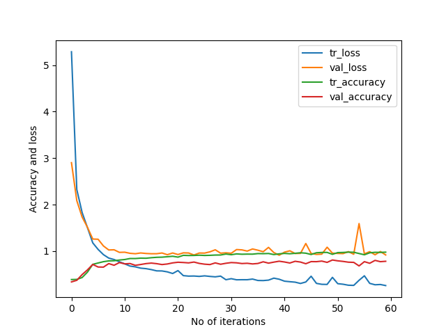

# DrivingDirection-80.8
Epoch 60: val_accuracy did not improve from 0.80775   
158/158 [==============================] - 4s 26ms/step - loss: 0.2575 - accuracy: 0.9761 - val_loss: 0.9165 - val_accuracy: 0.7801   
[[279  46  40]    
 [ 37 126   2]    
 [ 24  10 159]]    
158/158 [==============================] - 1s 7ms/step - loss: 0.3202 - accuracy: 0.9666   
23/23 [==============================] - 0s 8ms/step - loss: 0.9553 - accuracy: 0.8077     
Train: 0.967, Test: 0.808    
[[298  30  37]                 
 [ 44 118   3]                 
 [ 21   4 168]]              

